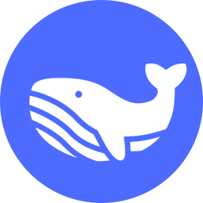
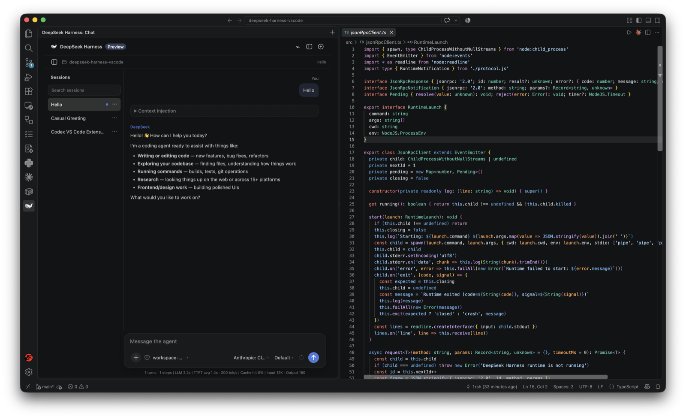

<p align="center"></p>

# DeepSeek Harness Chat for VS Code

*Unofficial, community-built extension — not affiliated with or endorsed by DeepSeek.*

<p align="center">
  <a href="https://marketplace.visualstudio.com/items?itemName=irsh.deepseek-harness-dsh-vscode"></a>
</p>

Install from the Marketplace link above, or paste `vscode:extension/irsh.deepseek-harness-dsh-vscode` into your browser's address bar to open it directly in VS Code.

Run a local [DeepSeek Harness](https://github.com/deepseek-ai/deepseek-harness) coding-agent runtime from the VS Code Activity Bar.

<p align="center"></p>

## Features

- Stream durable Harness session events in a native VS Code view.
- Create and resume workspace-scoped sessions.
- Queue prompts or cancel a running turn.
- Attach the active file or current selection explicitly.
- Answer Harness approval and user-question requests.
- Keep API keys and filesystem authority out of the webview.

## Setup

The extension connects to a DSH Web endpoint at `deepseekHarness.web.url` (default `http://127.0.0.1:3080`). If nothing is reachable there, it launches one automatically:

- `deepseekHarness.autoStart` (default `true`) enables auto-start.
- By default, the extension clones [deepseek-harness](https://github.com/deepseek-ai/deepseek-harness) into its own global storage on first use, runs `pnpm install`/`pnpm run build` there, then starts it with `pnpm dsh web --no-open`. First run takes a few minutes; later runs are fast (~10s).
- To use your own checkout instead, set `deepseekHarness.runtime.cwd` to its path (still runs via `pnpm`). To use a different command entirely, set `deepseekHarness.runtime.command`/`runtime.args` explicitly.

Requires `git` and `pnpm` on your `PATH`.

Configure the provider key (for example `DEEPSEEK_API_KEY`) in your shell environment or through your Harness deployment before starting VS Code.

## Development

```bash
npm install
npm run typecheck
npm test
npm run build
npm run package
```

Press **F5** in VS Code after adding a standard extension-host launch configuration, or install the generated `.vsix`.

## Security

The webview cannot execute shell commands or access files. It sends validated actions to the extension host; DSH remains responsible for sandbox and approval policy. Context is only attached when requested, and file navigation is constrained to the open workspace.

## Current scope

Desktop VS Code and local runtimes are supported. Remote extension hosts, browser-based VS Code, images, and full parity with the DSH Web GUI are not included in 0.0.1.

## Credits

- Author: [1rsh](https://github.com/1rsh)
- Icon: [Whale icons created by mnauliady - Flaticon](https://www.flaticon.com/free-icons/whale).
